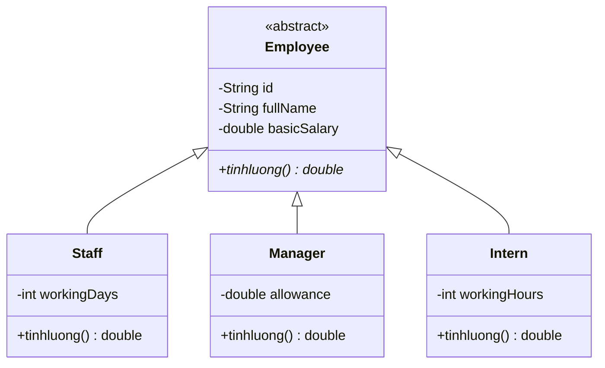

# HR Management App 📱

Ứng dụng quản lý nhân sự (HR Management) dành cho Android, được xây dựng với mục tiêu quản lý danh sách nhân viên, tính lương và lọc dữ liệu hiệu quả.

> [!IMPORTANT]
> **File APK: ** [HrManagementApp.apk](https://github.com/Nor262/B24DCCC229_KTGK_APP/blob/main/HrManagementApp.apk)

---

## 📖 Mục lục
1. [Tổng quan hệ thống](#tổng-quan-hệ-thống)
2. [Cấu trúc Project](#cấu-trúc-project)
3. [Mô hình quan hệ Class (Class Diagram)](#mô-hình-quan-hệ-class)
4. [Giải thích chi tiết mã nguồn](#giải-thích-chi-tiết-mã-nguồn)
    - [Models & Tính đa hình](#models--tính-đa-hình)
    - [Data Management & Singleton](#data-management--singleton)
    - [UI & Adapter](#ui--adapter)
5. [Tại sao lại viết code như vậy?](#tại-sao-lại-viết-code-như-vậy)
6. [Các hàm/phương thức chính](#các-hàmphương-thức-chính)

---

## 🌟 Tổng quan hệ thống
Hệ thống quản lý ba loại nhân viên chính: **Staff** (Nhân viên chính thức), **Manager** (Quản lý), và **Intern** (Thực tập sinh). Mỗi loại có cách tính lương và thông tin đặc thù khác nhau. Ứng dụng hỗ trợ các tính năng CRUD (Thêm, Xem, Sửa, Xóa), tìm kiếm, lọc theo loại và sắp xếp theo lương.

---

## 📂 Cấu trúc Project
```text
com.example.myapplication
├── data/
│   └── EmployeeManager.java      # Quản lý dữ liệu tập trung (Singleton)
├── models/
│   ├── Employee.java            # Lớp trừu tượng cơ sở
│   ├── Staff.java               # Lớp nhân viên chính thức
│   ├── Manager.java             # Lớp quản lý
│   └── Intern.java              # Lớp thực tập sinh
├── util/
│   └── CurrencyUtils.java        # Tiện ích định dạng tiền tệ (VND)
├── EmployeeAdapter.java         # Adapter hiển thị danh sách trong RecyclerView
├── MainActivity.java            # Màn hình chính (Danh sách, Tìm kiếm, Lọc)
├── EmployeeFormActivity.java    # Màn hình Thêm/Sửa nhân viên
└── EmployeeDetailActivity.java  # Màn hình xem chi tiết và Xóa
```

---

## 🏗 Mô hình quan hệ Class
Hệ thống sử dụng nguyên lý **Kế thừa (Inheritance)** và **Tính đa hình (Polymorphism)**:

- `Employee` (Abstract Class): Đóng vai trò là lớp cha, định nghĩa các thuộc tính chung (`id`, `fullName`, `basicSalary`) và phương thức trừu tượng `tinhluong()`.
- `Staff`, `Manager`, `Intern`: Kế thừa từ `Employee` và triển khai (implement) phương thức `tinhluong()` theo công thức riêng của từng loại.



---

## 🔍 Giải thích chi tiết mã nguồn

### 1. Models & Tính đa hình
Việc sử dụng lớp trừu tượng `Employee` cho phép ứng dụng quản lý một danh sách chung `ArrayList<Employee>`. Khi gọi hàm `employee.tinhluong()`, Java sẽ tự động xác định đối tượng thực tế là gì (Staff, Manager hay Intern) để gọi đúng công thức tính lương.

- **Staff**: Lương = `basicSalary * (workingDays / 26)`.
- **Manager**: Lương = `basicSalary + allowance`.
- **Intern**: Lương = `workingHours * 30,000`.

### 2. Data Management & Singleton
Lớp `EmployeeManager` sử dụng **Singleton Pattern**.
- **Tại sao?**: Để đảm bảo dữ liệu danh sách nhân viên được đồng nhất xuyên suốt các Activity (Main, Form, Detail). Mọi thay đổi ở màn hình này sẽ được phản ánh ngay lập tức ở màn hình khác mà không cần truyền dữ liệu phức tạp qua Intent.

### 3. UI & Adapter
- **ViewBinding**: Sử dụng ViewBinding thay vì `findViewById` để tăng tốc độ truy cập UI và tránh lỗi NullPointerException.
- **RecyclerView & Adapter**: Hiển thị danh sách mượt mà. Adapter xử lý việc hiển thị thông tin khác nhau dựa trên kiểu dữ liệu (`instanceof`).

---

## 💡 Tại sao lại viết code như vậy?

1.  **Tính đóng gói (Encapsulation)**: Các thuộc tính được để `private` và truy cập qua `getter/setter`. Đặc biệt trong `setter`, chúng ta thực hiện validation (ví dụ: ngày công phải từ 0-26, lương không được âm).
2.  **Tính dễ mở rộng (Extensibility)**: Nếu trong tương lai cần thêm loại nhân viên mới (ví dụ: Freelancer), ta chỉ cần tạo class mới kế thừa `Employee` mà không cần sửa đổi logic hiển thị danh sách.
3.  **Linh hoạt trong xử lý dữ liệu**: `EmployeeManager` tách biệt logic xử lý dữ liệu (Sorting, Filtering, Searching) ra khỏi UI (Activity), giúp code dễ đọc và bảo trì hơn (theo mô hình MVC/MVP đơn giản).

---

## ⚙️ Các hàm/phương thức chính

### `EmployeeManager.java`
- `getInstance()`: Khởi tạo/Lấy thực thể duy nhất của Manager.
- `addEmployee(Employee e)`: Thêm mới.
- `updateEmployee(Employee e)`: Tìm theo ID và cập nhật thông tin.
- `deleteEmployee(String id)`: Xóa nhân viên khỏi danh sách.
- `searchByName(String name)`: Tìm kiếm không phân biệt hoa thường.
- `filterByType(Class<?> type)`: Lọc nhân viên theo Class tương ứng.
- `getHighestSalaryEmployee()`: Tìm nhân viên có lương thực nhận cao nhất.

### `MainActivity.java`
- `setupRecyclerView()`: Khởi tạo danh sách hiển thị.
- `setupSearch()`: Sử dụng `TextWatcher` để tìm kiếm thời gian thực.
- `setupFilter()`: Sử dụng Spinner để lọc theo loại nhân viên.

### `CurrencyUtils.java`
- `formatVND(double amount)`: Chuyển đổi số thành định dạng tiền tệ Việt Nam (ví dụ: `1.000.000đ`) bằng `DecimalFormat`.

---
